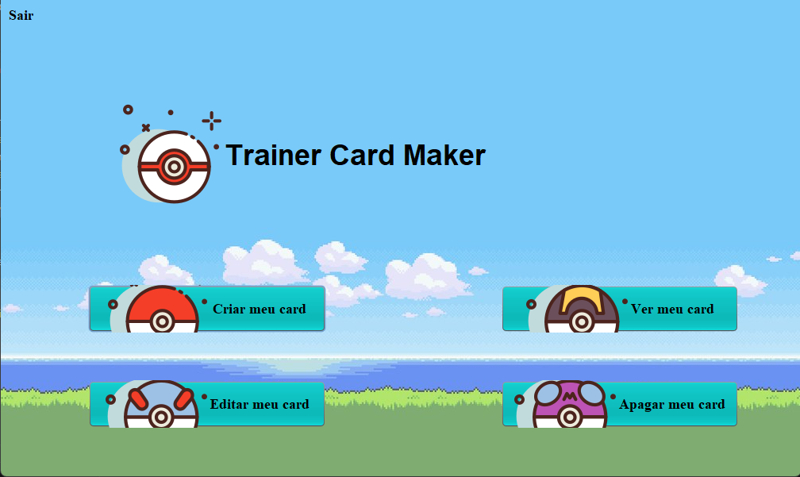
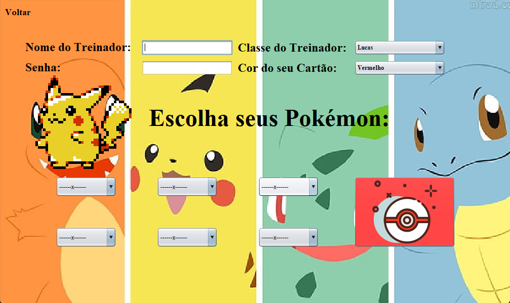
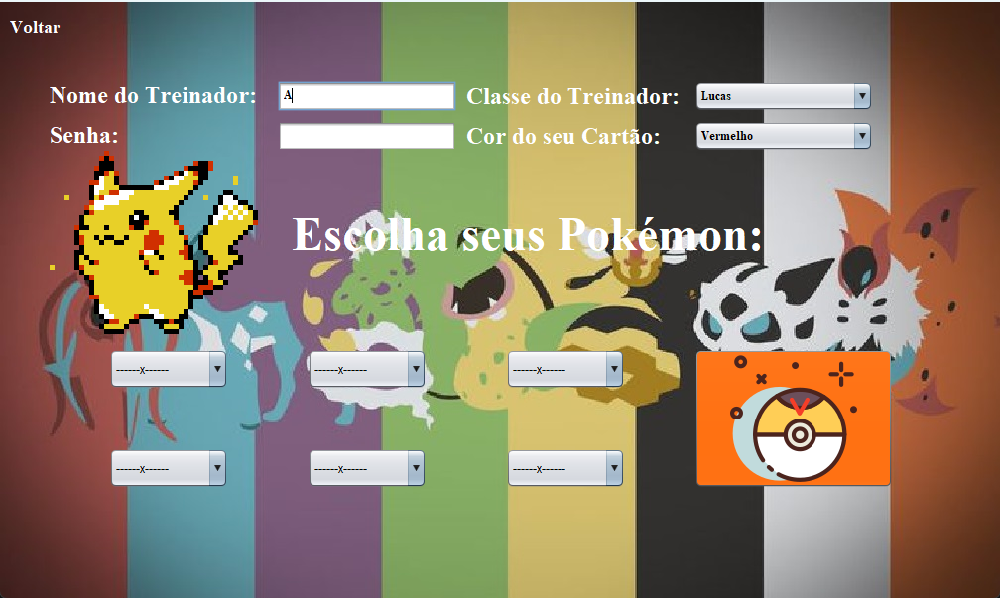
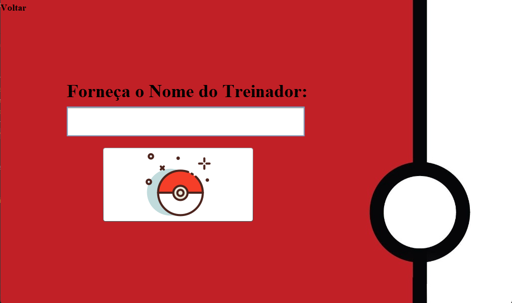
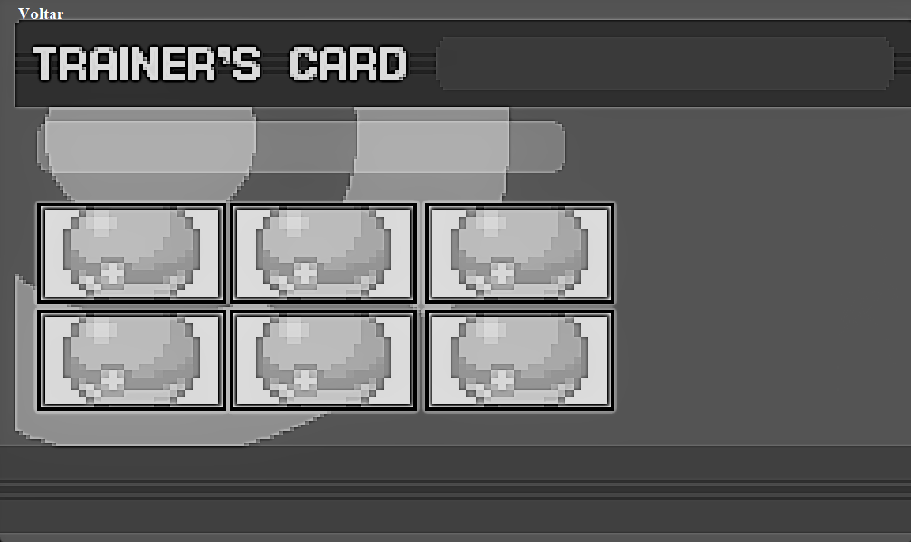
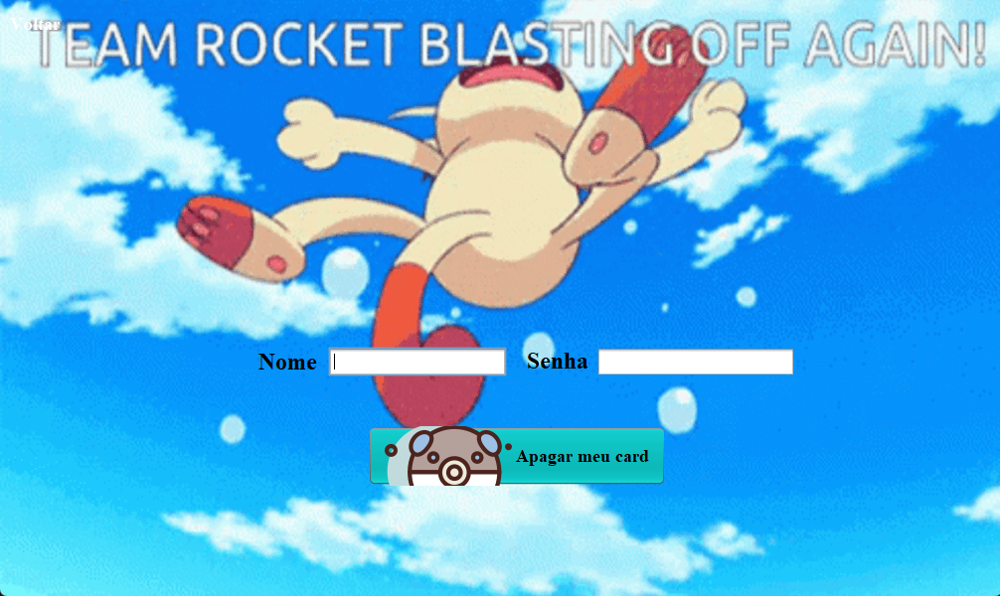

# Trainer-card-Maker
# Pokemon Trainer Card

Este projeto, **Pokemon Trainer Card**, é uma aplicação desenvolvida em **Java** que permite aos usuários criarem e gerenciarem seus próprios cartões de treinador Pokémon. Ele conta com uma interface gráfica intuitiva e funcionalidades como login, cadastro e gestão de cartões.

## Funcionalidades
- **Cadastro e login de usuários**
- **Criação e personalização de cartões de treinador**
- **Atualização e exclusão de cartões**
- **Visualização interativa dos cartões criados**

## Tecnologias Utilizadas
- **Linguagem:** Java
- **IDE:** NetBeans (uso do GUI Builder)
- **Bibliotecas:** 

## Estrutura do Projeto
```
PokemonTrainerCard/
|-- build.xml
|-- manifest.mf
|-- nbproject/  # Configurações do NetBeans
|-- src/
|   |-- pokemontrainercard/
|   |   |-- PokemonTrainerCard.java  # Classe principal
|   |   |-- Login.java, Menu.java  # Interface de login e menu
|   |   |-- Cadastro.java, Atualizar.java, Apagar.java  # Gestão de dados
|   |   |-- CardView.java  # Visualização dos cartões
|   |-- Imagens, PokeSprites, Trainers, etc.  # Recursos visuais

```

## Como Executar
1. **Clone o repositório**
   ```sh
   git clone https://github.com/Viihctor/Trainer-card-Maker.git
   ```
2. **Abra o projeto no NetBeans**
3. **Compile e execute a classe principal** (`PokemonTrainerCard.java`)

## Contribuição
Fique à vontade para contribuir com melhorias! Para isso:
1. Faça um fork do repositório
2. Crie uma nova branch (`git checkout -b minha-feature`)
3. Faça suas alterações e commit (`git commit -m 'Minha melhoria'`)
4. Envie as mudanças (`git push origin minha-feature`)
5. Abra um Pull Request

## Licença
Este projeto está sob a licença [MIT](LICENSE).

## Imagens do Projeto

### Menu Principal


### Tela de Criação


### Tela de Atualização


### Tela de Leitura


### Tela de Visualização


### Tela de Exclusão

